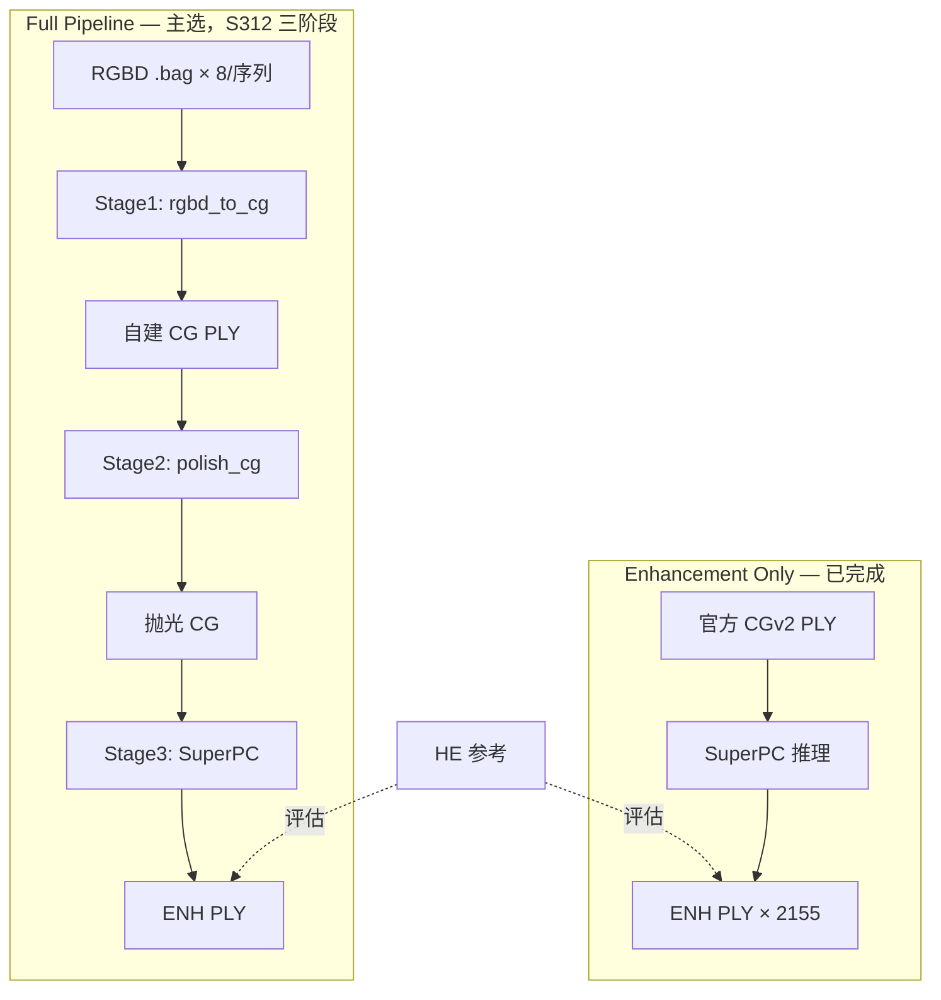

# GC2026 管线架构

## 竞赛背景

**UVG-CWI-DQPC** 提供 12 个动态点云序列。每个序列包含：

- **HE（High-End）**：参考真值点云（15fps PLY）
- **CG（Consumer-Grade）**：低质量输入点云（官方 CGv2_pload 或我们从 RGBD 重建）
- **RGBD**：8 路 RealSense `.bag`（30fps），用于 Full Pipeline 重建 CG

我们的增强模型是 **[SuperPC](https://github.com/sair-lab/SuperPC)**：点云补全 + 上采样，输出 ENH 点云参与 Chamfer 等指标评估。

---

## 双 Track 策略



| | Enhancement Only | Full Pipeline |
|---|------------------|---------------|
| CG 来源 | 赛方 CGv2_15 | 我们从 bag 重建 |
| 数据依赖 | 仅 CG PLY | bag + cwipc/librealsense |
| 当前产物 | `output/submission_candidate/` | 无 |
| manifest | Enhancement | 待全量跑通后更新 |

---

## 数据流与关键文件

### 原始数据布局

```
data/raw/UVG-CWI-DQPC/{Sequence}/
├── consumer-grade_capture_system/
│   ├── CG/15fps/*.ply          # 官方 CGv2（Enhancement 输入）
│   ├── camera_output/*.bag     # RGBD 录制（Full Pipeline 输入）
│   └── RGBD/                   # 解压后的彩色/深度图（post_rgbd_install 生成）
└── high-end_capture_system/HE/15fps/*.ply
```

12 个序列：`PinkNoir`, `TrumanShow`, `VirtualLife`, `TicTacToe`, `VictoryHeart`, `OrangeKettlebell`, `BlueSpeech`, `BlueVolley`, `BouncingBlue`, `FitFluencer`, `GoodVision`, `Mannequin`。

### 处理后索引（`data/processed/`）

| 文件 | 含义 |
|------|------|
| `all_cg_only_cgv2.txt` | 全量 2155 帧 CG 路径（Enhancement 输入列表） |
| `val_cg_only_cgv2.txt` | val 子集 362 帧（TicTacToe + VictoryHeart） |
| `all_pairs_cgv2.txt` | CG ↔ HE 配对（评估用） |
| `frame_playback_map_cgv2.json` | 15fps CG 帧 ↔ 30fps bag playback 时间 |
| `rgbd_pairs.txt` | CG 帧 ↔ RGB 图路径（vision / Stage1 用） |
| `cgv2_layout.json` | CGv2 安装目录扫描结果 |

### 帧率关系

- CG / HE：**15 fps**
- RGBD bag：**30 fps**
- `uvg_frame_map.py` + `frame_playback_map_cgv2.json` 负责对齐

---

## Stage1：RGBD → CG（CWIPC-Native）

**入口**：`scripts/rgbd_to_cg.py` + `scripts/run_cwipc_native_plan.sh`  
**主 KPI**：recon vs **HE**（非官方 CG）

- **PGDR hybrid**：TT→Open3D seq_only；VH→cwipc + fine-register（`stage1_config.json`）
- **CWIPC 滤波 profile**：`official` | `relaxed` | `mild`（`--cwipc-filter-profile`）
- **实验 sweep**：`run_cwipc_native_val362.py`（B0/B1/B2 hybrid + N0/N1/N2 pure cwipc）

详见 [`docs/CWIPC_NATIVE_PIPELINE.md`](CWIPC_NATIVE_PIPELINE.md)

---

## Stage2：SuperPC 推理

**入口**：`scripts/run_superpc_infer.py` / `scripts/run_dual_gpu_infer.sh`

主要步骤：

1. 加载 checkpoint（gate 选定 `kitti360_com.pth`）
2. 体素下采样 / 上采样（`blend_cg` 模式 + `blend_voxel_mm`）
3. SuperPC 网络推理
4. KNN 从输入 CG 迁移颜色到 ENH
5. 写出 `{Sequence}/ENH/15fps/*.ply`

输入 CG 来自 **Stage1**（CWIPC-Native winner 或 PGDR fallback）。

**编排**：`scripts/run_cwipc_native_plan.sh`

**环境**：conda `superpc`，CUDA Chamfer3D 扩展（`rebuild_extensions.sh`）

---

## 评估与 Gate

| 脚本 | 指标 |
|------|------|
| `evaluate_uvg.py` | Chamfer CD-L1（CG/ENH vs HE），默认 n=20k 采样 |
| `evaluate_color.py` | 颜色 PSNR-Y |
| `evaluate_temporal.py` | 相邻帧时序稳定性 |
| `val_gate.py` | 从 val_grid 选最优实验 |

**Gate 结果**：`output/val_grid/gate_decision.json`  
胜者：`kitti360_com.pth` + `output_mode=blend_cg` + `blend_voxel_mm=3.0`

---

## 提交流程

1. `make_submission.py` — 生成 `manifest.json`（描述 processing_track、依赖、命令）
2. `submissions/GC2026_Team/src/` — 可复现脚本副本
3. 组织方在 **官方 CG 或 RGBD** 上运行，不要求提交 PLY

本地备份 ENH：`output/submission_candidate/`（~19GB，非提交物）

---

## 脚本分层（mental model）

```
scripts/
├── env_setup.sh / install_cwipc.sh     # 环境
├── download_*.sh / extract_rgbd_zips.sh # 数据获取
├── prepare_uvg_pairs.py / map_rgbd_pairs.py  # 索引
├── rgbd_to_cg.py                       # Stage1
├── run_cwipc_native_plan.sh            # CWIPC-Native 两阶段编排
├── run_superpc_infer.py                # Stage2 SuperPC
├── run_enhancement_only.sh             # Enhancement 一键
├── run_full_pipeline.sh                # Full 一键
├── evaluate_uvg.py / val_gate.py       # 评估
├── migrate_to_new_server.sh            # 迁移
└── check_integrity.sh                  # 完整性
```

---

## 硬件假设

- 目标：**2× NVIDIA RTX 5090**
- 双卡分片：`run_dual_gpu_infer.sh`（pending 列表在 `.dual_gpu_shards/`）
- 无 GPU 机：可跑 CPU eval、数据下载、librealsense 编译（`overnight_nogpu.sh`）
